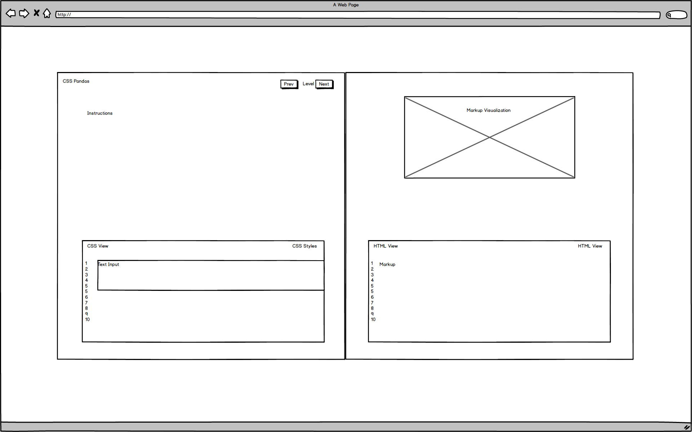

## CSS Pandas

### Background

This project is based on Flexbox Froggy but it's tailored to teach CSS basics for selectors. There Are various different types of selector options in the 5 levels, from basic element selectors to descendant selectors.

The project will be an interactive tutorial with an input field for the user to input their answer and an HTML viewer that shows the user the current layout of the code displayed visually on the right hand side.

### Functionality & MVP  

With CSS Pandas, users will be able to:

- [ ] Use CSS selectors to pick the element requested in the instructions.
- [ ] Go through 5 different levels.
- [ ] Levels save using local storage.
- [ ] Has a visual display for the code in the HTML viewer.
- [ ] Has directions for eah level.

In addition, this project will include:

- [ ] A production Readme

### Wireframes

This app will be a single page app built with vanilla Javascript, jQuery, HTML, and CSS. The page will have a viewer for CSS user input and have a markup of the HTML code in the HTML viewer for the user to see how the visual portion is laid out.

### Architecture and Technologies

This project will be implemented with the following technologies:

- Vanilla JavaScript/jQuery for game logic and CSS for the visual rendering of the HTML markup.
- Webpack to bundle scripts.

### Implementation Timeline

**Day 1**: Choose which levels and CSS concepts to create levels/descriptions with. Get basic HTML view up and start the CSS layout, structure for the main page. Goals for the day:

- Get main HTML view set up.
- Start game logic inside of css_pandas.js.
- Get basic jQuery working to append elements to HTML elements
- Write level 1.

**Day 2**: Continue building out game logic and levels. Add more CSS to the code editor and HTML viewer.

- Finish levels 2-3.
- Get basic CSS done (positioning and sizing).
- Choose typeface and color palette for project if not done already.

**Day 3** Finish the game logic and logic for various different buttons. Finish up the levels and create the markup function that will display the correct HTML markup inside the HTML viewer.

- Finish levels 3-5.
- Finish up css_pandas.js.
- Make sure that the markup function correctly displays the level setup, including different attributes.
- Finish styling.

### Bonus

- More than 5 levels.
- Animate.css for the element that the user should be picking.
