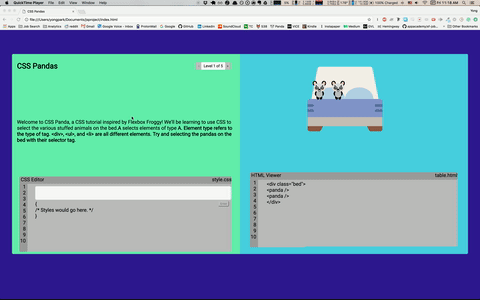

# CSS pandas
+ [CSS Pandas](https://winstonjz.github.io/return_gnome/)

CSS Pandas is a CSS tutorial game for beginners. Players will select various different stuffed animals using different CSS techniques.

# How to Play
Using the CSS code editor, players will input the correct selector the instructions are asking for. When the answer is correct, the enter button will become available to click and move on to the next level.

# Local storage

The app will keep track of where you leave off when if you refresh using local storage.

# Architecture and Frameworks

* jQuery and vanilla JavaScript for the game logic.

# Future Features

* More levels and CSS selector techniques.
* Better styling.
* Animate.css to help users pinpoint which element the instructions are asking to choose.
